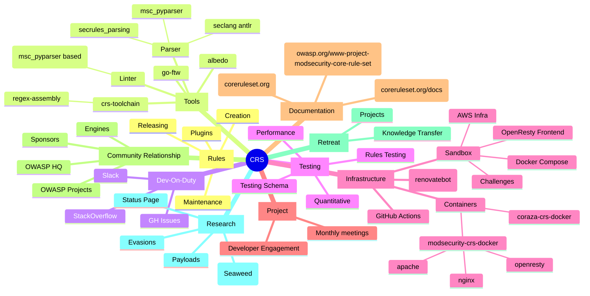

# This is CRS

```mermaid
mindmap
  root((CRS))
    id[Rules]
      Creation
      Maintenance
      Releasing
      Plugins
    id[Tools]
      crs-toolchain
        regex-assembly
      go-ftw
      albedo
      Parser
        secrules_parsing
        seclang antlr
        msc_pyparser
      Linter
        rules-check (msc_pyparser based)
    id[Dev-On-Duty]
      Slack
      GH Issues
      StackOverflow
    id[Testing]
      Rules Testing
      Testing Schema
      Quantitative
      Performance
    id[Infrastructure]
      Updates (renovatebot)
      GitHub Actions
      Containers
        modsecurity-crs-docker
          apache
          nginx
          openresty
        coraza-crs-docker
      Sandbox
        AWS Infra
        OpenResty Frontend
        Challenges
        Docker Compose
    id[Project]
      Monthly meetings
      Developer Engagement
    id[Documentation]
      Website Blogs (coreruleset.org)
      Documentation (coreruleset.org/docs)
      OWASP Website (owasp.org/www-project-modsecurity-core-rule-set)
    id[Community Relationship]
      Sponsors
      Engines
      OWASP Projects
      OWASP HQ
    id[Retreat]
      Projects
      Knowledge Transfer
    id[Research]
      CVEs (Seaweed)
      Status Page
      Payloads
      Evasions
```
